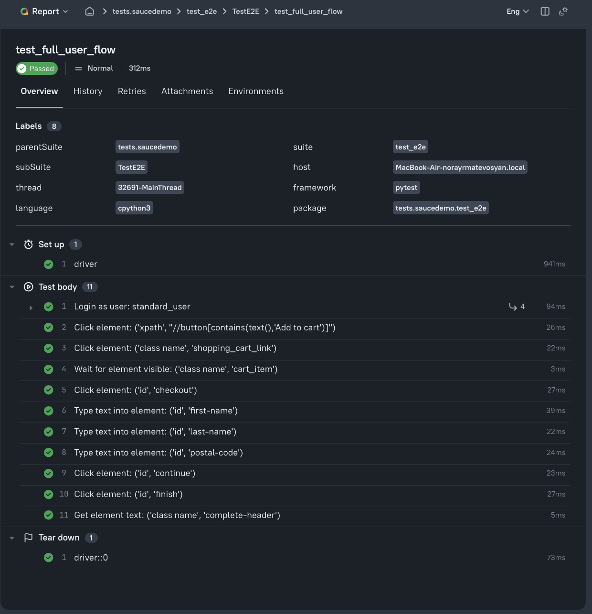
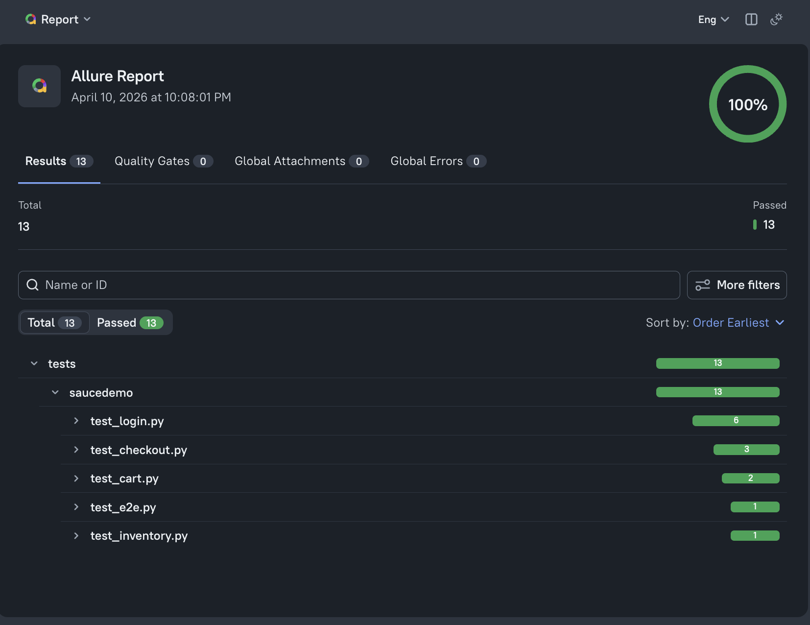

## 📁 Project Structure
```
project/
│
├── pages/
│ ├── saucedemo/
│ │ ├── login_page.py
│ │ ├── inventory_page.py
│ │ ├── cart_page.py
│ │ ├── checkout_page.py
│ │ ├── action_bot.py
│ │ ├── base_page.py
│ │ ├── types.py
│
├── tests/
│ ├── saucedemo/
│ │ ├── test_login.py
│ │ ├── test_inventory.py
│ │ ├── test_cart.py
│ │ ├── test_checkout.py
│ │ ├── test_e2e.py
│ │ ├── conftest.py
│
├── utils/
│ ├── chrome_driver.py
│ ├── firefox_driver.py
│ ├── constants.py
│
├── pytest.ini
├── README.md
```

## 📸 Allure Report

### 🔹 Overview


### 🔹 Test Details
